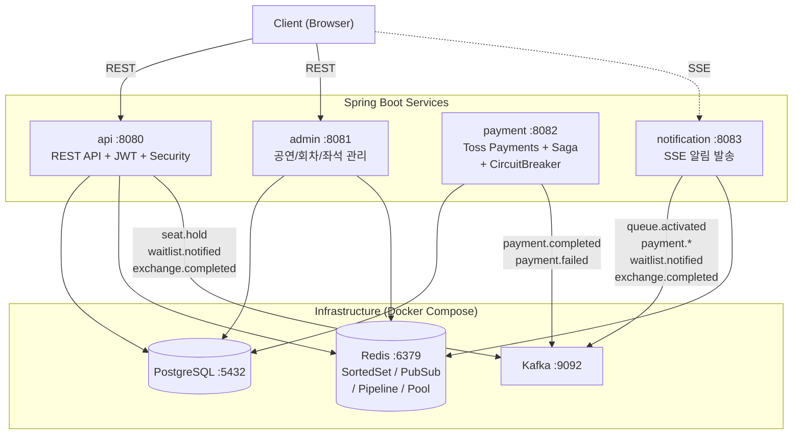
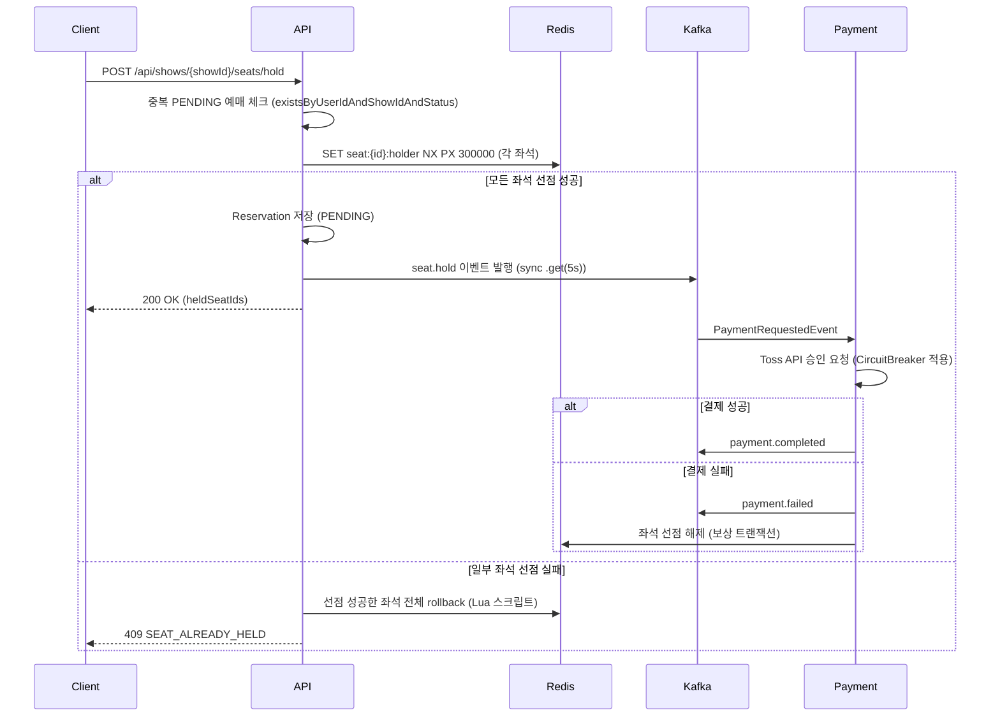

# StagePass - 공연 티켓 예매 시스템

> Kafka 기반 분산 처리 & Redis 동시성 제어로 구현한 이벤트 기반 MSA 프로젝트

## 목차

- [프로젝트 소개](#프로젝트-소개)
- [핵심 기술 과제](#핵심-기술-과제)
- [기술 스택](#기술-스택)
- [시스템 아키텍처](#시스템-아키텍처)
- [멀티모듈 구조](#멀티모듈-구조)
- [ERD](#erd)
- [주요 기능](#주요-기능)
- [Kafka 토픽 설계](#kafka-토픽-설계)
- [결제 Saga 흐름](#결제-saga-흐름)
- [대기열 시스템](#대기열-시스템)
- [취소 대기 시스템](#취소-대기-시스템)
- [자리 교환](#자리-교환)
- [안정성 설계](#안정성-설계)
- [부하 테스트 결과](#부하-테스트-결과-k6)
- [실행 방법](#실행-방법)

<br>

## 프로젝트 소개

**StagePass**는 뮤지컬, 콘서트 등 공연 티켓을 예매할 수 있는 플랫폼입니다.

티켓팅 오픈 시 발생하는 **트래픽 폭증**과 **동시 좌석 선점** 문제를 Apache Kafka와 Redis를 활용해 해결하는 것에 초점을 맞췄습니다. 단순 CRUD를 넘어, 실제 서비스 수준의 동시성 제어·이벤트 기반 분산 처리·실시간 대기열을 직접 구현했습니다.

<br>

## 핵심 기술 과제

### ⚡ 1. 좌석 동시성 제어
수천 명이 동시에 같은 좌석을 선택할 때 단 한 명만 선점되어야 합니다.

- Redis `SET NX PX` 명령으로 **원자적 선점** 구현
- TTL 5분 설정으로 미결제 시 자동 해제
- Lua 스크립트(`GET + DEL`)로 선점 해제 시 race condition 방지
- 선점 만료 이벤트를 Kafka로 발행해 DB 상태 동기화
- 동일 회차 PENDING 예매 중복 선점 방지 (`existsByUserIdAndShowIdAndStatus`)

```
좌석 선택 요청 (동시 N명)
       ↓
Redis SET NX PX → 1명만 성공, 나머지 즉시 실패 반환
       ↓
Reservation 저장 (PENDING) + seat.hold 이벤트 발행
```

### 🔄 2. 결제 분산 처리 (Saga 패턴)
결제 성공/실패 이벤트를 Kafka로 발행하고, 각 후처리를 독립 Consumer가 담당합니다.

- 결제 실패 시 **보상 트랜잭션**으로 선점 좌석 자동 해제
- 서비스 간 강결합 제거 — 각 Consumer 독립 배포 가능
- 멱등성 보장으로 중복 결제 방지 (`toss_order_id` unique 제약)
- **Kafka 발행 동기화**: `.get(5s)`로 DB 커밋 후 이벤트 미발행 방지
- **결제 취소 멱등성**: 이미 CANCELLED 상태이면 Toss API 재호출 없이 반환

### 🚦 3. 실시간 대기열
티켓 오픈 순간 접속자를 순번 관리하고 입장 시점을 실시간으로 안내합니다.

- Redis Sorted Set으로 **진입 timestamp 기반 순번 관리**
- SSE(Server-Sent Events) + **Redis Pub/Sub**으로 다중 인스턴스 환경에서 실시간 전달
- 앞 사람 결제 완료마다 `queue.activated` 이벤트 발행, 다음 배치 자동 활성화

### 🔔 4. 취소 대기 & 자리 교환
매진 이후에도 좌석을 얻을 수 있는 두 가지 경로를 제공합니다.

- **취소 대기**: Redis Sorted Set(score = 등록 timestamp)으로 순번 관리 → 예매 취소 발생 시 1순위 대기자에게 Kafka → SSE 알림
- **자리 교환**: 같은 회차 예매자끼리 좌석 교환 제안/수락 → JPA 비관적 락(작은 ID 먼저)으로 원자적 소유자 스왑, 데드락 방지

<br>

## 기술 스택

| 영역 | 기술 |
|------|------|
| Backend | Java 21, Spring Boot 3.3, Gradle 멀티모듈 |
| Message Broker | Apache Kafka |
| Cache / 동시성 | Redis 7 (Lettuce, Sorted Set, Pub/Sub, Pipeline) |
| Database | PostgreSQL 16 |
| 결제 | 토스페이먼츠 |
| 실시간 통신 | SSE (Server-Sent Events) + Redis Pub/Sub |
| 인증 | JWT (Access 1h + Refresh 7d), BCrypt |
| 회로 차단기 | resilience4j (`@CircuitBreaker`) |
| API 문서 | SpringDoc OpenAPI (Swagger UI) |
| 테스트 | JUnit 5, Mockito, Testcontainers |
| 로컬 인프라 | Docker Compose |

<br>

## 시스템 아키텍처



### 좌석 선점 시퀀스



<br>

## 멀티모듈 구조

```
stagepass/
├── common/            # 예외, 응답 포맷, 공통 유틸
├── domain/            # 엔티티, 레포지토리, 비즈니스 로직
├── infra/             # Redis · Kafka 공통 설정
├── kafka/             # Producer / Consumer
├── payment/           # 토스페이먼츠 연동, Saga 처리
├── notification/      # SSE 알림 Consumer
├── api/               # REST API, JWT 인증 (메인 앱 :8080)
└── admin/             # 어드민 API (별도 앱 :8081)
```

**의존 관계**

```
api, admin
  └── domain, infra, kafka, payment, notification
        └── common
```

- `api`, `admin` 만 `@SpringBootApplication` 보유 (실행 가능 jar)
- 나머지 모듈은 라이브러리 역할

<br>

## ERD

```
performances (공연)
  └── shows (회차)
        └── zones (구역: VIP / R / S / A석)
              └── seats (좌석: R-01-05 형식)

users
  └── reservations (예매)
        ├── reservation_seats (예매-좌석 N:M)
        └── payments (결제)

shows
  ├── queue_entries (대기열)
  ├── waitlist_entries (취소 대기)
  └── seat_exchanges (자리 교환 제안)
```

주요 설계 포인트
- `seats.status` — Redis가 primary (AVAILABLE / HOLDING / RESERVED), DB는 최종 확정 상태
- `reservations.expires_at` — 선점 후 5분 만료 기준
- `payments.toss_order_id` — unique 제약으로 중복 결제 방지
- **복합 인덱스**: `reservations(status, expires_at)`, `seat_exchanges(status, expires_at)`, `transfers(status, expires_at)` — 스케줄러 배치 조회 최적화
- `seats(zone_id)` — JOIN FETCH 쿼리 성능 개선

<br>

## 주요 기능

### 사용자 API
| 기능 | 설명 |
|------|------|
| 회원가입 / 로그인 | JWT (Access 1h + Refresh 7d), Redis Refresh Token 관리 |
| 토큰 재발급 / 로그아웃 | Refresh Token 검증, Redis 토큰 삭제 |
| 공연 목록 조회 | 회차별 좌석 현황 포함 |
| 좌석 선점 | Redis 원자적 선점 (SET NX), TTL 5분, 실패 시 전체 롤백, 중복 선점 방지 |
| 결제 요청 | 토스페이먼츠 연동, Kafka 이벤트 발행 (동기 확인) |
| 예매 내역 | JOIN FETCH로 N+1 방지 |
| 실시간 알림 | SSE + Redis Pub/Sub — 예매 완료 / 결제 실패 / 대기열 입장 / 취소 대기 / 교환 완료 |
| 대기열 | Redis Sorted Set 순번 발급, 실시간 순번 안내 |
| 취소 대기 | Redis Sorted Set 기반 순번 추적, 예매 취소 시 1순위 자동 알림 |
| 자리 교환 | 동일 회차 예매자 간 좌석 교환 제안/수락, 비관적 락으로 원자적 스왑 |

### 관리자 API
| 기능 | 설명 |
|------|------|
| 공연 등록 / 수정 / 삭제 | 공연 기본 정보 관리 |
| 회차 관리 | 날짜 / 시간, 총 좌석 수 설정 |
| 구역 / 좌석 설정 | 등급별 가격, 행/열 기반 좌석 일괄 생성 |
| 예매 현황 | 회차별 예매 목록 조회 (LEFT JOIN 단일 쿼리) |
| 대시보드 | 총 예매/확정/취소/매출/오늘통계 — 단일 집계 쿼리 |

<br>

## Kafka 토픽 설계

| 토픽 | 발행 주체 | 소비 주체 | 설명 |
|------|-----------|-----------|------|
| `ticket.seat.hold` | api | kafka | 좌석 임시 선점 기록 |
| `ticket.seat.hold.expired` | kafka (TTL) | kafka | 선점 만료 처리 |
| `ticket.seat.released` | kafka | kafka | 선점 해제 |
| `payment.requested` | api | payment | 결제 요청 |
| `payment.completed` | payment | kafka, notification, api(queue) | 결제 성공 |
| `payment.failed` | payment | kafka, notification | 결제 실패 → 보상 트랜잭션 |
| `payment.cancel.requested` | api | payment | 결제 취소 요청 |
| `reservation.confirmed` | kafka | notification | 예매 최종 확정 |
| `reservation.cancelled` | api | kafka, notification | 예매 취소 |
| `notification.send` | 각 Consumer | notification | 알림 발송 요청 |
| `queue.entered` | api | kafka | 대기열 진입 |
| `queue.activated` | kafka | notification | 입장 허가 |
| `waitlist.notified` | api | notification | 취소 대기 1순위 알림 |
| `exchange.completed` | api | notification | 자리 교환 완료 알림 (양측) |

**Consumer Group 분리 설계**
- `payment.completed` 토픽을 `reservation-group`(예매 확정)과 `queue-payment-group`(대기열 활성화)이 독립 소비 → 각 로직 독립 처리

<br>

## 결제 Saga 흐름

```
1. 사용자 결제 요청
        ↓
2. payment.requested 발행 (sync .get(5s) — 발행 실패 시 트랜잭션 롤백)
        ↓
3. Payment Consumer (CircuitBreaker 적용)
   └── 토스페이먼츠 API 호출
         ├── 성공 → payment.completed 발행
         └── 실패 → payment.failed 발행
        ↓
4-A. payment.completed
   ├── reservation-group     : DB 예매 확정
   ├── queue-payment-group   : 다음 대기열 배치 활성화
   └── Notification Consumer : 완료 알림 발송

4-B. payment.failed (보상 트랜잭션)
   ├── Seat Consumer         : Redis 선점 해제
   └── Notification Consumer : 실패 알림 발송
```

<br>

## 대기열 시스템

```
Redis Sorted Set
  Key   : queue:{showId}
  Score : 진입 timestamp
  Value : userId

흐름
  1. 사용자 접속 → 순번 발급 (ZADD)
  2. SSE 연결 유지 → 현재 순번 실시간 전달
  3. 앞 사람 결제 완료 → queue-payment-group Consumer가 activateNextBatch() 호출
  4. queue.activated 발행 → Notification Consumer → Redis Pub/Sub → SSE push
  5. 입장 후 대기열에서 제거 (ZREM)
```

<br>

## 취소 대기 시스템

매진 공연에서 예매 취소가 발생하면 대기자 순번 순서대로 알림을 보냅니다.

```
Redis Sorted Set
  Key   : waitlist:{showId}
  Score : 등록 timestamp
  Value : userId

흐름
  1. 사용자 등록 → ZADD + DB WaitlistEntry 저장
     → 현재 순번(ZRANK + 1) / 전체 대기 수(ZCARD) 즉시 반환
  2. 예매 취소 발생 (REQUIRES_NEW 별도 트랜잭션)
     → ZPOPMIN으로 1순위 userId 추출
     → DB 조회 실패 시 userId를 ZADD로 복구 (고아 레코드 방지)
     → DB 상태 NOTIFIED 업데이트 (10분 예매 유효)
     → waitlist.notified 발행 → SSE 알림 전송
  3. 대기 취소 → ZREM + DB 상태 CANCELLED
```

- 이탈 시 순번 자동 재계산 (ZSet 특성 활용)
- DB는 이력 보존용, 실시간 순번은 Redis가 단독 처리
- `notifyNext()`는 `REQUIRES_NEW`로 호출자 트랜잭션과 분리 → 알림 실패가 예매 취소를 롤백시키지 않음

<br>

## 자리 교환

같은 회차 예매자끼리 좌석을 교환합니다.

```
흐름
  1. 제안자 → POST /api/exchanges (내 예매 ID + 상대 예매 ID)
     - 유효성 검증: 같은 회차 여부, 두 예매 모두 CONFIRMED 상태
     - 중복 제안 방지: PENDING 상태 교환 이미 존재 시 거절
  2. 수락자 → POST /api/exchanges/{id}/accept
     - 비관적 락 획득 (데드락 방지: 작은 ID 먼저 락)
     - 두 예매의 user 원자적 스왑
     - exchange.completed 발행 → 양측 SSE 알림
  3. 거절/취소 → 상태만 변경 (REJECTED / CANCELLED)
```

**데드락 방지 설계**
```
A가 res1 → res2 순으로 락, B가 res2 → res1 순으로 락 시도 → 교착
해결: 항상 MIN(id) 먼저 락 → 모든 트랜잭션이 동일한 순서로 락 획득
```

<br>

## 안정성 설계

### Kafka 발행 신뢰성
```
// 기존: 비동기 — DB 커밋 후 Kafka 미발행 상태 가능
kafkaTemplate.send(...).whenComplete((result, ex) -> { ... });

// 개선: 동기 — 발행 실패 시 즉시 예외 → 호출자 트랜잭션 롤백
kafkaTemplate.send(...).get(5, TimeUnit.SECONDS);
```

### Kafka 포이즌 필 처리
Consumer가 역직렬화 불가 메시지를 받으면 무한 재시도가 발생합니다.
```java
catch (JsonProcessingException e) {
    // 역직렬화 불가 → acknowledge 후 드랍 (포이즌 필 격리)
    ack.acknowledge();
} catch (Exception e) {
    // 그 외 일시적 오류 → DefaultErrorHandler 재시도 위임
    throw new RuntimeException(e);
}
```

### 회로 차단기 (resilience4j)
Toss API 장애 시 모든 결제 요청이 타임아웃 대기하는 연쇄 장애를 방지합니다.
```yaml
resilience4j:
  circuitbreaker:
    instances:
      toss:
        sliding-window-size: 10
        failure-rate-threshold: 50      # 실패율 50% 초과 시 OPEN
        wait-duration-in-open-state: 30s
        permitted-number-of-calls-in-half-open-state: 3
```

### SSE 수평 확장 — Redis Pub/Sub
단일 서버 인메모리 Emitter 저장 방식의 한계를 Redis Pub/Sub으로 해결합니다.
```
기존: 서버 A에 SSE 연결 / Kafka Consumer는 서버 B에서 실행 → push 불가

개선:
  Kafka Consumer(서버 B) → Redis Publish(notification:{userId})
  서버 A → PatternTopic("notification:*") Subscribe → SSE push ✅
```

### Kafka Producer 설정
```java
RETRY_BACKOFF_MS_CONFIG = 1000        // 재시도 간격 1초 (즉시 연속 재시도 방지)
MAX_IN_FLIGHT_REQUESTS_PER_CONNECTION = 5
ACKS_CONFIG = "all"                   // 메시지 유실 방지
```

### Redis 연결 풀 (Lettuce)
```yaml
spring.data.redis.lettuce.pool:
  max-active: 20
  max-idle: 10
  min-idle: 2
  max-wait: 1000ms
```

<br>

## 부하 테스트 결과 (k6)

로컬 환경(MacBook M2, Docker)에서 k6로 측정한 결과입니다.
임계값(p95 500ms, 에러율 1%)을 코드로 정의하고 이를 초과하면 테스트가 자동 실패하도록 구성했습니다.

### 처리량 테스트 — 좌석 목록 조회 API

| 항목 | 최적화 전 | 최적화 후 |
|------|-----------|-----------|
| p95 응답시간 | 임계값 초과 | **10ms** |
| 에러율 | - | **0.01%** 미만 |
| 총 요청 수 | - | 12,949건 |

**병목 원인**: 좌석마다 구역 정보를 별도 조회하는 N+1 쿼리  
**해결**: JOIN FETCH 쿼리 통합 + Redis `@Cacheable` (TTL 10s) + Redis Pipeline TTL 일괄 조회

### 동시 선점 테스트 — Redis SET NX 원자성 검증

| 항목 | 결과 |
|------|------|
| 동시 VU | **1,000명** |
| 선점 성공 | **1명** (목표: exactly 1) |
| SEAT_ALREADY_HELD (409) | **997건** |
| p95 응답시간 | 1,183ms (로컬 1000-VU 극한 환경) |

> 1,000명이 동일 좌석에 동시 요청해도 **정확히 1명만 선점 성공** — Redis 원자성 검증 완료

<br>

## 실행 방법

### 1. 인프라 실행

```bash
docker-compose up -d
```

| 서비스 | 포트 |
|--------|------|
| PostgreSQL | 5432 |
| Redis | 6379 |
| Kafka | 9092 |
| Zookeeper | 2181 |

### 2. 설정 파일 생성

```bash
cp api/src/main/resources/application-local.yaml.example api/src/main/resources/application-local.yaml
cp payment/src/main/resources/application-local.yaml.example payment/src/main/resources/application-local.yaml
```

`application-local.yaml`에서 JWT 시크릿, Toss API 키를 설정합니다.

### 3. 애플리케이션 실행

```bash
# API 서버 (:8080)
./gradlew :api:bootRun --args='--spring.profiles.active=local'

# 결제 서버 (:8082)
./gradlew :payment:bootRun --args='--spring.profiles.active=local'

# 알림 서버 (:8083)
./gradlew :notification:bootRun --args='--spring.profiles.active=local'

# 관리자 서버 (:8081)
./gradlew :admin:bootRun --args='--spring.profiles.active=local'
```

### 4. API 문서 확인

- API: http://localhost:8080/swagger-ui.html
- Admin: http://localhost:8081/swagger-ui.html

### 5. 테스트 실행

```bash
./gradlew test
```

주요 테스트:
- `AuthServiceTest` — 회원가입, 로그인, 토큰 재발급, 로그아웃 (8개)
- `SeatServiceTest` — 좌석 선점 성공/실패/롤백/중복방지/해제 (6개)
- `PaymentServiceTest` — 결제 성공/실패/멱등성/취소 멱등성/Toss실패/역직렬화 (6개)
- `QueueServiceTest` — 대기열 진입/순번/입장 허가 (12개)
- `WaitlistServiceTest` — 취소대기 등록/중복/상태조회/이탈/알림/DB실패복구 (7개)
- `SeatConcurrencyIntegrationTest` — **실제 Redis(Testcontainers)** 동시 선점 원자성 검증 (3개, Docker 없는 환경 자동 skip)
