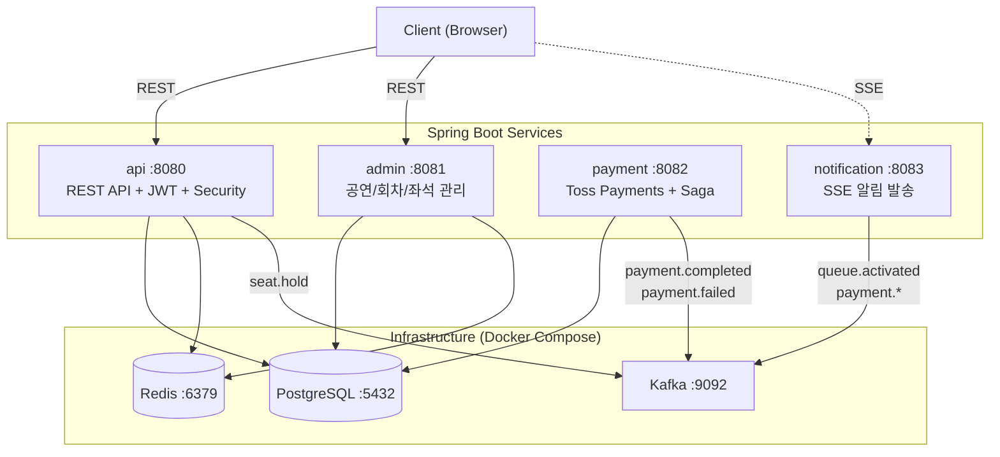
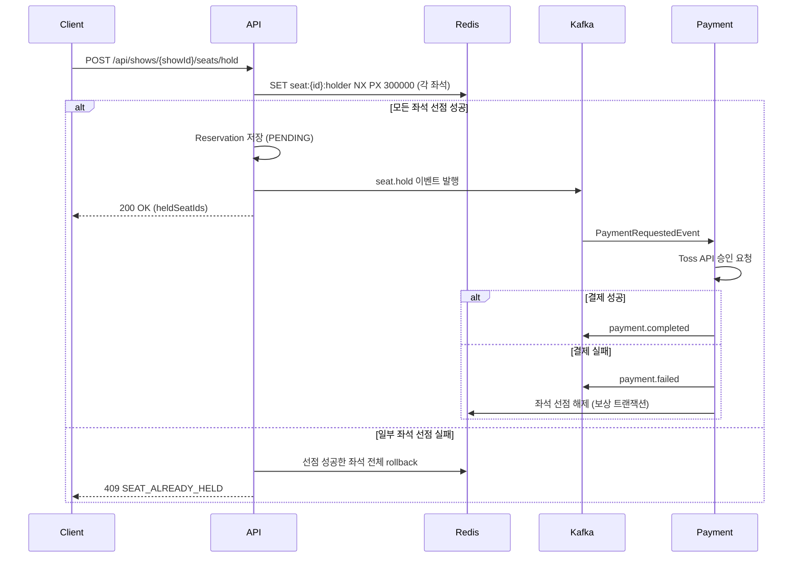

# StagePass - 공연 티켓 예매 시스템

> Kafka 기반 분산 처리 & Redis 동시성 제어로 구현한 이벤트 기반 MSA 프로젝트

## 목차

- [프로젝트 소개](#프로젝트-소개)
- [핵심 기술 과제](#핵심-기술-과제)
- [기술 스택](#기술-스택)
- [시스템 아키텍처](#시스템-아키텍처)
- [멀티모듈 구조](#멀티모듈-구조)
- [ERD](#erd)
- [주요 기능](#주요-기능)
- [Kafka 토픽 설계](#kafka-토픽-설계)
- [결제 Saga 흐름](#결제-saga-흐름)
- [대기열 시스템](#대기열-시스템)
- [실행 방법](#실행-방법)

<br>

## 프로젝트 소개

**StagePass**는 뮤지컬, 콘서트 등 공연 티켓을 예매할 수 있는 플랫폼입니다.

티켓팅 오픈 시 발생하는 **트래픽 폭증**과 **동시 좌석 선점** 문제를 Apache Kafka와 Redis를 활용해 해결하는 것에 초점을 맞췄습니다. 단순 CRUD를 넘어, 실제 서비스 수준의 동시성 제어·이벤트 기반 분산 처리·실시간 대기열을 직접 구현했습니다.

<br>

## 핵심 기술 과제

### ⚡ 1. 좌석 동시성 제어
수천 명이 동시에 같은 좌석을 선택할 때 단 한 명만 선점되어야 합니다.

- Redis `SET NX PX` 명령으로 **원자적 선점** 구현
- TTL 5분 설정으로 미결제 시 자동 해제
- 선점 만료 이벤트를 Kafka로 발행해 DB 상태 동기화

```
좌석 선택 요청 (동시 N명)
       ↓
Redis SET NX PX → 1명만 성공, 나머지 즉시 실패 반환
       ↓
ticket.seat.hold 이벤트 발행 → Consumer가 DB 기록
```

### 🔄 2. 결제 분산 처리 (Saga 패턴)
결제 성공/실패 이벤트를 Kafka로 발행하고, 각 후처리를 독립 Consumer가 담당합니다.

- 결제 실패 시 **보상 트랜잭션**으로 선점 좌석 자동 해제
- 서비스 간 강결합 제거 — 각 Consumer 독립 배포 가능
- 멱등성 보장으로 중복 결제 방지 (`toss_order_id` unique 제약)

### 🚦 3. 실시간 대기열
티켓 오픈 순간 접속자를 순번 관리하고 입장 시점을 실시간으로 안내합니다.

- Redis Sorted Set으로 **진입 timestamp 기반 순번 관리**
- SSE(Server-Sent Events)로 대기 순번 실시간 전달
- 앞 사람 결제 완료마다 `queue.activated` 이벤트 발행

<br>

## 기술 스택

| 영역 | 기술 |
|------|------|
| Backend | Java 21, Spring Boot 3.3, Gradle 멀티모듈 |
| Message Broker | Apache Kafka |
| Cache / 동시성 | Redis 7 |
| Database | PostgreSQL 16 |
| 결제 | 토스페이먼츠 |
| 실시간 통신 | SSE (Server-Sent Events) |
| 인증 | JWT (Access 1h + Refresh 7d), BCrypt |
| API 문서 | SpringDoc OpenAPI (Swagger UI) |
| 테스트 | JUnit 5, Mockito |
| 로컬 인프라 | Docker Compose |

<br>

## 시스템 아키텍처



### 좌석 선점 시퀀스



<br>

## 멀티모듈 구조

```
stagepass/
├── common/            # 예외, 응답 포맷, 공통 유틸
├── domain/            # 엔티티, 레포지토리, 비즈니스 로직
├── infra/             # Redis · Kafka 공통 설정
├── kafka/             # Producer / Consumer
├── payment/           # 토스페이먼츠 연동, Saga 처리
├── notification/      # SSE 알림 Consumer
├── api/               # REST API, JWT 인증 (메인 앱 :8080)
└── admin/             # 어드민 API (별도 앱 :8081)
```

**의존 관계**

```
api, admin
  └── domain, infra, kafka, payment, notification
        └── common
```

- `api`, `admin` 만 `@SpringBootApplication` 보유 (실행 가능 jar)
- 나머지 모듈은 라이브러리 역할

<br>

## ERD

```
performances (공연)
  └── shows (회차)
        └── zones (구역: VIP / R / S / A석)
              └── seats (좌석: R-01-05 형식)

users
  └── reservations (예매)
        ├── reservation_seats (예매-좌석 N:M)
        └── payments (결제)

shows
  └── queue_entries (대기열)
```

주요 설계 포인트
- `seats.status` — Redis가 primary (AVAILABLE / HOLDING / RESERVED), DB는 최종 확정 상태
- `reservations.expires_at` — 선점 후 5분 만료 기준
- `payments.toss_order_id` — unique 제약으로 중복 결제 방지

<br>

## 주요 기능

### 사용자 API
| 기능 | 설명 |
|------|------|
| 회원가입 / 로그인 | JWT (Access 1h + Refresh 7d), Redis Refresh Token 관리 |
| 토큰 재발급 / 로그아웃 | Refresh Token 검증, Redis 토큰 삭제 |
| 공연 목록 조회 | 회차별 좌석 현황 포함 |
| 좌석 선점 | Redis 원자적 선점 (SET NX), TTL 5분, 실패 시 전체 롤백 |
| 결제 요청 | 토스페이먼츠 연동, Kafka 이벤트 발행 |
| 예매 내역 | JOIN FETCH로 N+1 방지 |
| 실시간 알림 | SSE — 예매 완료 / 결제 실패 / 대기열 입장 |
| 대기열 | Redis Sorted Set 순번 발급, 실시간 순번 안내 |

### 관리자 API
| 기능 | 설명 |
|------|------|
| 공연 등록 / 수정 / 삭제 | 공연 기본 정보 관리 |
| 회차 관리 | 날짜 / 시간, 총 좌석 수 설정 |
| 구역 / 좌석 설정 | 등급별 가격, 행/열 기반 좌석 일괄 생성 |
| 예매 현황 | 회차별 예매 목록 조회 |

<br>

## Kafka 토픽 설계

| 토픽 | 발행 주체 | 소비 주체 | 설명 |
|------|-----------|-----------|------|
| `ticket.seat.hold` | api | kafka | 좌석 임시 선점 기록 |
| `ticket.seat.hold.expired` | kafka (TTL) | kafka | 선점 만료 처리 |
| `ticket.seat.released` | kafka | kafka | 선점 해제 |
| `payment.requested` | api | payment | 결제 요청 |
| `payment.completed` | payment | kafka, notification | 결제 성공 |
| `payment.failed` | payment | kafka, notification | 결제 실패 → 보상 트랜잭션 |
| `reservation.confirmed` | kafka | notification | 예매 최종 확정 |
| `reservation.cancelled` | api | kafka, notification | 예매 취소 |
| `notification.send` | 각 Consumer | notification | 알림 발송 요청 |
| `queue.entered` | api | kafka | 대기열 진입 |
| `queue.activated` | kafka | notification | 입장 허가 |

<br>

## 결제 Saga 흐름

```
1. 사용자 결제 요청
        ↓
2. payment.requested 발행
        ↓
3. Payment Consumer
   └── 토스페이먼츠 API 호출
         ├── 성공 → payment.completed 발행
         └── 실패 → payment.failed 발행
        ↓
4-A. payment.completed
   ├── Reservation Consumer  : DB 예매 확정
   ├── Seat Consumer         : Redis HOLDING → DB RESERVED
   └── Notification Consumer : 완료 알림 발송

4-B. payment.failed (보상 트랜잭션)
   ├── Seat Consumer         : Redis 선점 해제
   └── Notification Consumer : 실패 알림 발송
```

<br>

## 대기열 시스템

```
Redis Sorted Set
  Key   : queue:{showId}
  Score : 진입 timestamp
  Value : userId

흐름
  1. 사용자 접속 → 순번 발급 (ZADD)
  2. SSE 연결 유지 → 현재 순번 실시간 전달
  3. 앞 사람 결제 완료 → queue.activated 발행
  4. Consumer → 다음 사용자 SSE로 "입장 가능" 전달
  5. 입장 후 대기열에서 제거 (ZREM)
```

<br>

## 실행 방법

### 1. 인프라 실행

```bash
docker-compose up -d
```

| 서비스 | 포트 |
|--------|------|
| PostgreSQL | 5432 |
| Redis | 6379 |
| Kafka | 9092 |
| Zookeeper | 2181 |

### 2. 설정 파일 생성

```bash
cp api/src/main/resources/application-local.yaml.example api/src/main/resources/application-local.yaml
cp payment/src/main/resources/application-local.yaml.example payment/src/main/resources/application-local.yaml
```

`application-local.yaml`에서 JWT 시크릿, Toss API 키를 설정합니다.

### 3. 애플리케이션 실행

```bash
# API 서버 (:8080)
./gradlew :api:bootRun --args='--spring.profiles.active=local'

# 결제 서버 (:8082)
./gradlew :payment:bootRun --args='--spring.profiles.active=local'

# 알림 서버 (:8083)
./gradlew :notification:bootRun --args='--spring.profiles.active=local'

# 관리자 서버 (:8081)
./gradlew :admin:bootRun --args='--spring.profiles.active=local'
```

### 4. API 문서 확인

- API: http://localhost:8080/swagger-ui.html
- Admin: http://localhost:8081/swagger-ui.html

### 5. 테스트 실행

```bash
./gradlew test
```

주요 테스트:
- `AuthServiceTest` — 회원가입, 로그인, 토큰 재발급, 로그아웃 (8개)
- `SeatServiceTest` — 좌석 선점 성공/실패/롤백 (4개)
- `PaymentServiceTest` — 결제 성공/실패/멱등성 (3개)
