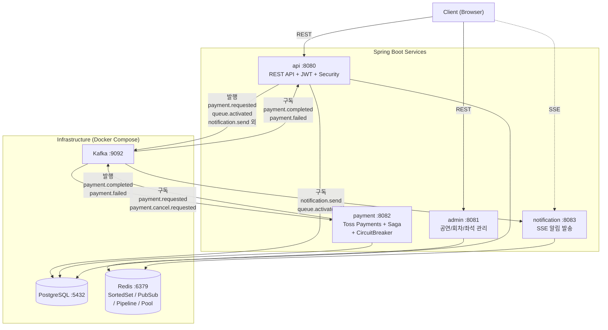
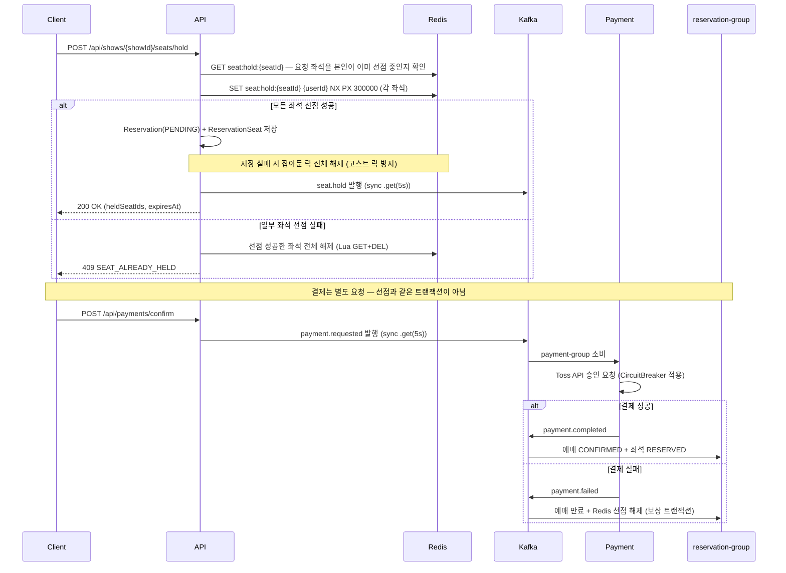
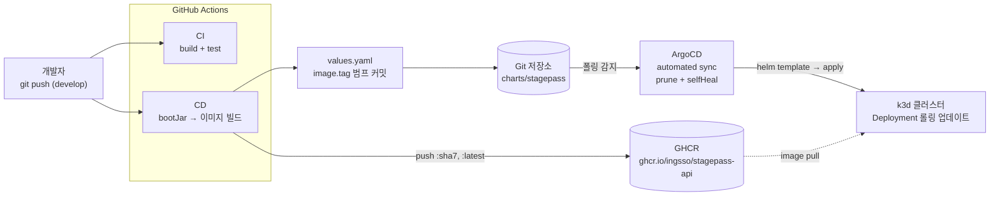
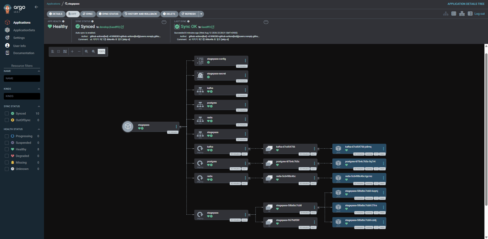

# StagePass - 공연 티켓 예매 시스템

> Kafka 기반 분산 처리 & Redis 동시성 제어로 구현한 이벤트 기반 MSA 프로젝트

## 목차

- [프로젝트 소개](#프로젝트-소개)
- [데모 영상](#데모-영상)
- [핵심 기술 과제](#핵심-기술-과제)
- [기술 스택](#기술-스택)
- [시스템 아키텍처](#시스템-아키텍처)
- [멀티모듈 구조](#멀티모듈-구조)
- [ERD](#erd)
- [주요 기능](#주요-기능)
- [Kafka 토픽 설계](#kafka-토픽-설계)
- [결제 Saga 흐름](#결제-saga-흐름)
- [대기열 시스템](#대기열-시스템)
- [취소 대기 시스템](#취소-대기-시스템)
- [자리 교환](#자리-교환)
- [안정성 설계](#안정성-설계)
- [부하 테스트 결과](#부하-테스트-결과-k6)
- [Kubernetes 배포 (GitOps)](#kubernetes-배포-gitops)
- [실행 방법](#실행-방법)

<br>

## 프로젝트 소개

**StagePass**는 뮤지컬, 콘서트 등 공연 티켓을 예매할 수 있는 플랫폼입니다.

티켓팅 오픈 시 발생하는 **트래픽 폭증**과 **동시 좌석 선점** 문제를 Apache Kafka와 Redis를 활용해 해결하는 것에 초점을 맞췄습니다. 단순 CRUD를 넘어, 실제 서비스 수준의 동시성 제어·이벤트 기반 분산 처리·실시간 대기열을 직접 구현했습니다.

<br>

## 데모 영상

### Scenario 1 — 일반 유저 예매 성공 플로우

https://github.com/user-attachments/assets/scenario1-video

> 대기열 진입 → 순번 확인 → 좌석 선택 → 결제 완료까지의 전체 플로우

### Scenario 2 — 더블 부킹 버그 현장 (동시 좌석 선점)

> 두 유저가 동일 좌석으로 나란히 결제창에 도착하는 동시성 충돌 시나리오

**유저 A 시점**

https://github.com/user-attachments/assets/scenario2-userA-video

**유저 B 시점**

https://github.com/user-attachments/assets/scenario2-userB-video

### Scenario 3 — 관리자 공연 등록 플로우

https://github.com/user-attachments/assets/scenario3-video

> 어드민 페이지에서 공연 등록 → 회차 / 구역 / 좌석 일괄 생성까지의 플로우

<br>

## 핵심 기술 과제

### ⚡ 1. 좌석 동시성 제어
수천 명이 동시에 같은 좌석을 선택할 때 단 한 명만 선점되어야 합니다.

- Redis `SET NX PX` 명령으로 **원자적 선점** 구현
- TTL 5분 설정으로 미결제 시 자동 해제
- Lua 스크립트(`GET + DEL`)로 선점 해제 시 race condition 방지
- 선점 만료 이벤트를 Kafka로 발행해 DB 상태 동기화
- 중복 선점 방지 — **요청한 좌석을 본인이 이미 선점 중일 때만** 차단
- 예매 저장 실패 시 잡아둔 Redis 락을 직접 해제 (**고스트 락 방지**)

> 중복 선점 판정은 원래 "동일 회차에 PENDING 예매가 있으면 무조건 차단"이었습니다.
> 이 규칙은 한 명이 여러 좌석을 나눠 선점하는 정상 요청까지 막아, 판정 범위를 요청 좌석으로 좁혔습니다.

> `@Transactional`은 DB만 롤백합니다. 예매 저장이 실패하면 이미 잡은 Redis 좌석 락이 TTL(5분)
> 만료까지 남아 **아무도 예매할 수 없는 좌석(고스트 락)** 이 됩니다. 저장 실패 시 선점한 락을 모두 해제합니다.

```
좌석 선택 요청 (동시 N명)
       ↓
Redis SET NX PX → 1명만 성공, 나머지 즉시 실패 반환
       ↓
Reservation 저장 (PENDING) + seat.hold 이벤트 발행
```

### 🔄 2. 결제 분산 처리 (Saga 패턴)
결제 성공/실패 이벤트를 Kafka로 발행하고, 각 후처리를 독립 Consumer가 담당합니다.

- 결제 실패 시 **보상 트랜잭션**으로 선점 좌석 자동 해제
- 서비스 간 강결합 제거 — 각 Consumer 독립 배포 가능
- 멱등성 보장으로 중복 결제 방지 (`toss_order_id` unique 제약)
- **Kafka 발행 동기화**: `.get(5s)`로 DB 커밋 후 이벤트 미발행 방지
- **결제 취소 멱등성**: 이미 CANCELLED 상태이면 Toss API 재호출 없이 반환

### 🚦 3. 실시간 대기열
티켓 오픈 순간 접속자에게 순번을 발급하고, 입장 시점을 실시간으로 알립니다.

- Redis Sorted Set으로 **회차별 `INCR` 시퀀스 기반 순번 관리** (고유·단조 증가 score — 동점 없음)
- 앞 사람 결제 완료마다 `queue.activated` 이벤트 발행, 다음 배치(10명) 자동 활성화
- **입장 허가**는 SSE(Server-Sent Events) + **Redis Pub/Sub**으로 다중 인스턴스 환경에서 push
  (현재 순번 자체는 `GET /api/shows/{showId}/queue/status` 폴링으로 조회)

### 🔔 4. 취소 대기 & 자리 교환
매진 이후에도 좌석을 얻을 수 있는 두 가지 경로를 제공합니다.

- **취소 대기**: Redis Sorted Set(score = 등록 timestamp)으로 순번 관리 → 예매 취소 발생 시 1순위 대기자에게 Kafka → SSE 알림
- **자리 교환**: 같은 회차 예매자끼리 좌석 교환 제안/수락 → JPA 비관적 락(작은 ID 먼저)으로 원자적 소유자 스왑, 데드락 방지

<br>

## 기술 스택

| 영역 | 기술 |
|------|------|
| Backend | Java 21, Spring Boot 3.3, Gradle 멀티모듈 |
| Message Broker | Apache Kafka |
| Cache / 동시성 | Redis 7 (Lettuce, Sorted Set, Pub/Sub, Pipeline) |
| Database | PostgreSQL 16 |
| 결제 | 토스페이먼츠 |
| 실시간 통신 | SSE (Server-Sent Events) + Redis Pub/Sub |
| 인증 | JWT (Access 30m + Refresh 7d), BCrypt |
| 회로 차단기 | resilience4j (`@CircuitBreaker`) |
| API 문서 | SpringDoc OpenAPI (Swagger UI) |
| 테스트 | JUnit 5, Mockito, Testcontainers |
| 로컬 인프라 | Docker Compose |

<br>

## 시스템 아키텍처



> 토픽별 발행·소비 주체 전체는 [Kafka 토픽 설계](#kafka-토픽-설계) 표를 참고하세요.

### 좌석 선점 시퀀스



<br>

## 멀티모듈 구조

```
stagepass/
├── common/            # 예외, 응답 포맷, 공통 유틸
├── domain/            # 엔티티, 레포지토리, 비즈니스 로직
├── infra/             # Redis · Kafka 공통 설정
├── kafka/             # Producer / Consumer
├── payment/           # 토스페이먼츠 연동, Saga 처리
├── notification/      # SSE 알림 Consumer
├── api/               # REST API, JWT 인증 (메인 앱 :8080)
└── admin/             # 어드민 API (별도 앱 :8081)
```

**의존 관계**

```
실행 가능 앱 (@SpringBootApplication)        의존 모듈
──────────────────────────────────────────────────────────────
api          :8080  ──▶  common, domain, infra, kafka
admin        :8081  ──▶  common, domain, infra
payment      :8082  ──▶  common, domain, infra, kafka
notification :8083  ──▶  common, infra, kafka
```

- **실행 가능 jar 는 4개** — `api`, `admin`, `payment`, `notification` 모두 독립 앱입니다
- `common`, `domain`, `infra`, `kafka` 는 라이브러리 모듈 (앱이 아님)
- `notification` 은 DB 를 쓰지 않아 `domain` 에 의존하지 않습니다
  (`DataSourceAutoConfiguration` 을 명시적으로 제외)
- 앱끼리는 서로 의존하지 않습니다 — 통신은 오직 Kafka 를 통해서만 이뤄집니다

<br>

## ERD

```
performances (공연)
  └── shows (회차)
        └── zones (구역: VIP / R / S / A석)
              └── seats (좌석: R-01-05 형식)

users
  └── reservations (예매)
        ├── reservation_seats (예매-좌석 N:M)
        └── payments (결제)

shows
  ├── queue_entries (대기열)
  ├── waitlist_entries (취소 대기)
  └── seat_exchanges (자리 교환 제안)

reservations
  └── transfers (양도)
```

주요 설계 포인트
- `seats.status` — Redis가 primary (AVAILABLE / HOLDING / RESERVED), DB는 최종 확정 상태
- `reservations.expires_at` — 선점 후 5분 만료 기준
- `payments.toss_order_id` — unique 제약으로 중복 결제 방지
- **복합 인덱스**: `reservations(status, expires_at)`, `seat_exchanges(status, expires_at)`, `transfers(status, expires_at)` — 스케줄러 배치 조회 최적화
- `seats(zone_id)` — JOIN FETCH 쿼리 성능 개선

<br>

## 주요 기능

### 사용자 API
| 기능 | 설명 |
|------|------|
| 회원가입 / 로그인 | JWT (Access 30m + Refresh 7d), Redis Refresh Token 관리 |
| 토큰 재발급 / 로그아웃 | Refresh Token 검증, Redis 토큰 삭제 |
| 공연 목록 조회 | 회차별 좌석 현황 포함 |
| 좌석 선점 | Redis 원자적 선점 (SET NX), TTL 5분, 실패 시 전체 롤백 + Redis 락 해제, 중복 선점 방지 |
| 결제 요청 | 토스페이먼츠 연동, Kafka 이벤트 발행 (동기 확인) |
| 예매 내역 | JOIN FETCH로 N+1 방지 |
| 실시간 알림 | SSE + Redis Pub/Sub — 대기열 입장 / 취소 대기 / 교환 완료 / 양도 수락 / 선점 만료 |
| 대기열 | Redis Sorted Set 순번 발급 (INCR 시퀀스 score — 순번 중복 없음), 입장 허가 SSE push + 순번 폴링 조회 |
| 취소 대기 | Redis Sorted Set 기반 순번 추적, 예매 취소 시 1순위 자동 알림 |
| 자리 교환 | 동일 회차 예매자 간 좌석 교환 제안/수락, 비관적 락으로 원자적 스왑 |

### 관리자 API

어드민 기능은 **두 서버에 나뉘어 있고, 보호 방식이 다릅니다.**

- **admin 서버(8081)** — `AdminSecurityConfig` 의 `anyRequest().hasRole("ADMIN")` 으로 일괄 보호
  (예외: `/admin/auth/**`, Swagger)
- **api 서버(8080)** — 공연 CUD 엔드포인트에 `@PreAuthorize("hasRole('ADMIN')")` 개별 적용
  (`@EnableMethodSecurity` 활성화됨. 조회 API 는 비인증 허용)

| 기능 | 서버 · 엔드포인트 | 설명 |
|------|------------------|------|
| 공연 등록 | 8081 `POST /admin/performances`<br>8081 `POST /api/performances` (별칭)<br>8080 `POST /api/performances` | 8081 은 공연 + 회차 일괄 생성 (`showDatetimes` → SCHEDULED 회차, `totalSeats=0`)<br>8080 은 공연만 생성 |
| 공연 수정 / 삭제 | 8080 `PUT` · `DELETE /api/performances/{id}` | 공연 기본 정보 관리 |
| 회차 등록 | 8080 `POST /api/performances/{id}/shows` | 날짜 / 시간, 총 좌석 수 설정 |
| 회차 상태 변경 | 8081 `PATCH /admin/performances/shows/{showId}/status` | SCHEDULED → ON_SALE → CLOSED |
| 구역 / 좌석 설정 | 8081 `POST /admin/performances/shows/{showId}/zones` | 등급별 가격, 행/열 기반 좌석 일괄 생성 |
| 예매 현황 | 8081 `GET /admin/performances/{performanceId}/shows/stats` | 회차별 확정 예매 수 집계 (LEFT JOIN + GROUP BY 단일 쿼리) |
| 대시보드 | 8081 `GET /admin/dashboard` | 총 예매/확정/취소/매출/오늘통계 — 6회 → 1회 단일 집계 쿼리 |

> 공연 등록 경로가 3개인 것은 프론트 호출 경로(`/api/performances`)를 8081·8080 양쪽에서 받아주기 때문입니다.
> 8081 의 별칭만 회차 일괄 생성을 지원하므로, 실제 등록은 8081 경로를 사용합니다.

<br>

## Kafka 토픽 설계

| 토픽 | 발행 | 소비 (Consumer Group) | 설명 |
|------|------|----------------------|------|
| `ticket.seat.hold` | api | — | 좌석 임시 선점 기록 (발행만) |
| `ticket.seat.hold.expired` | api (만료 스케줄러) | kafka · `seat-group` ¹ | 선점 만료 통지 |
| `payment.requested` | api | payment · `payment-group` | 결제 요청 |
| `payment.completed` | payment | kafka · `reservation-group`<br>api · `queue-payment-group`<br>kafka · `seat-group` ¹ | 결제 성공 → 예매 확정 + 다음 배치 활성화 |
| `payment.failed` | payment | kafka · `reservation-group`<br>api · `waitlist-group`<br>kafka · `seat-group` ¹ | 결제 실패 → 보상 트랜잭션 + 취소 대기 알림 |
| `payment.cancel.requested` | api | payment · `payment-cancel-group` | 결제 취소 요청 |
| `reservation.cancelled` | api | — | 예매 취소 (발행만) |
| `notification.send` | api (만료 스케줄러, 양도) | notification · `notification-group` | 알림 발송 요청 |
| `queue.entered` | api | — | 대기열 진입 (발행만) |
| `queue.activated` | api | kafka · `queue-group`<br>notification · `notification-group` | 입장 허가 → DB 상태 갱신 + SSE 알림 |
| `transfer.claimed` | api | notification · `notification-group` | 양도 수락 알림 |
| `waitlist.notified` | api | notification · `notification-group` | 취소 대기 1순위 알림 |
| `exchange.completed` | api | notification · `notification-group` | 자리 교환 완료 알림 (양측) |

¹ `seat-group` 핸들러는 현재 로그만 남깁니다. 좌석 상태 확정·복원은 `reservation-group` 이,
선점 해제는 Redis TTL 만료가 담당합니다.

> `KafkaTopics` 에 상수만 정의되어 있고 발행·소비가 모두 없는 토픽: `ticket.seat.released`, `reservation.confirmed`.
> `ticket.seat.hold` · `queue.entered` · `reservation.cancelled` 은 발행되지만 아직 구독자가 없습니다 — 후속 기능을 위한 이벤트 로그입니다.

**Consumer Group 분리 설계**
- `payment.completed` 를 `reservation-group`(예매 확정)과 `queue-payment-group`(다음 배치 활성화)이 독립 소비 → 각 로직이 서로를 막지 않고 개별 재시도
- `payment.failed` 를 `reservation-group`(보상 트랜잭션)과 `waitlist-group`(취소 대기 1순위 알림)이 독립 소비
- 알림은 별도 앱(notification :8083)이 `notification-group` 으로 전담 → 알림 장애가 예매·결제 처리를 막지 않음

<br>

## 결제 Saga 흐름

```
1. 사용자 결제 요청
        ↓
2. payment.requested 발행 (sync .get(5s) — 발행 실패 시 트랜잭션 롤백)
        ↓
3. Payment Consumer (CircuitBreaker 적용)
   └── 토스페이먼츠 API 호출
         ├── 성공 → payment.completed 발행
         └── 실패 → payment.failed 발행
        ↓
4-A. payment.completed
   ├── reservation-group     : 예매 CONFIRMED + 좌석 RESERVED 확정
   ├── queue-payment-group   : 다음 대기열 배치 활성화
   └── seat-group            : 로그만 기록

4-B. payment.failed (보상 트랜잭션)
   ├── reservation-group     : 예매 만료 처리 + Redis 선점 해제
   ├── waitlist-group        : 취소 대기 1순위에게 알림 (waitlist.notified 발행)
   └── seat-group            : 로그만 기록
```

> 결제 성공·실패 시점에 **구매자에게 직접 가는 SSE 알림은 아직 없습니다.**
> 현재 SSE로 전달되는 이벤트는 입장 허가·취소 대기·자리 교환·양도·선점 만료 5종입니다.

<br>

## 대기열 시스템

```
Redis Sorted Set
  Key   : queue:{showId}
  Score : queue:seq:{showId} 의 INCR 시퀀스  ← 진입 timestamp 아님
  Value : userId

흐름
  1. 사용자 접속 → 순번 발급 (INCR → ZADD NX → ZRANK)
  2. SSE 연결 유지 → 현재 순번 실시간 전달
  3. 앞 사람 결제 완료 → queue-payment-group Consumer가 activateNextBatch() 호출
  4. queue.activated 발행 → Notification Consumer → Redis Pub/Sub → SSE push
  5. 입장 후 대기열에서 제거 (ZREM)
```

**score 를 밀리초 타임스탬프로 쓰면 안 됩니다.** 동시 진입 시 같은 밀리초가 대량으로 발생하고,
동점 멤버는 Redis 가 userId 사전순으로 정렬합니다. `ZADD` 와 `ZRANK` 는 별도 왕복이므로
내가 `ZADD` 한 뒤 순번을 읽기 전에 같은 score 의 더 작은 userId 가 끼어들면 순번이 밀리고,
**두 사용자가 같은 순번을 읽습니다.** (1,000명 동시 진입 실측: 중복 10건 / 누락 10건)

회차별 `INCR` 시퀀스는 고유하고 단조 증가하므로 뒤에 들어온 멤버가 앞사람 순번을 밀 수 없습니다.
`ZADD NX` 로 재진입(멱등 호출)이 기존 순번을 뒤로 밀어내지 않도록 합니다.
→ 1,000명 동시 진입에서 **중복 0건 / 누락 0건** ([부하 테스트 결과](#대기열-동시-진입-테스트--순번-유일성-검증))

<br>

## 취소 대기 시스템

매진 공연에서 예매 취소가 발생하면 대기자 순번 순서대로 알림을 보냅니다.

```
Redis Sorted Set
  Key   : waitlist:{showId}
  Score : 등록 timestamp
  Value : userId

흐름
  1. 사용자 등록 → ZADD + DB WaitlistEntry 저장
     → 현재 순번(ZRANK + 1) / 전체 대기 수(ZCARD) 즉시 반환
  2. 예매 취소 발생 (REQUIRES_NEW 별도 트랜잭션)
     → ZPOPMIN으로 1순위 userId 추출
     → DB 조회 실패 시 userId를 ZADD로 복구 (고아 레코드 방지)
     → DB 상태 NOTIFIED 업데이트 (10분 예매 유효)
     → waitlist.notified 발행 → SSE 알림 전송
  3. 대기 취소 → ZREM + DB 상태 CANCELLED
```

- 이탈 시 순번 자동 재계산 (ZSet 특성 활용)
- DB는 이력 보존용, 실시간 순번은 Redis가 단독 처리
- `notifyNext()`는 `REQUIRES_NEW`로 호출자 트랜잭션과 분리 → 알림 실패가 예매 취소를 롤백시키지 않음

<br>

## 자리 교환

같은 회차 예매자끼리 좌석을 교환합니다.

```
흐름
  1. 제안자 → POST /api/exchanges (내 예매 ID + 상대 예매 ID)
     - 유효성 검증: 같은 회차 여부, 두 예매 모두 CONFIRMED 상태
     - 중복 제안 방지: PENDING 상태 교환 이미 존재 시 거절
  2. 수락자 → POST /api/exchanges/{id}/accept
     - 비관적 락 획득 (데드락 방지: 작은 ID 먼저 락)
     - 두 예매의 user 원자적 스왑
     - exchange.completed 발행 → 양측 SSE 알림
  3. 거절/취소 → 상태만 변경 (REJECTED / CANCELLED)
```

**데드락 방지 설계**
```
A가 res1 → res2 순으로 락, B가 res2 → res1 순으로 락 시도 → 교착
해결: 항상 MIN(id) 먼저 락 → 모든 트랜잭션이 동일한 순서로 락 획득
```

<br>

## 안정성 설계

### Kafka 발행 신뢰성
```
// 기존: 비동기 — DB 커밋 후 Kafka 미발행 상태 가능
kafkaTemplate.send(...).whenComplete((result, ex) -> { ... });

// 개선: 동기 — 발행 실패 시 즉시 예외 → 호출자 트랜잭션 롤백
kafkaTemplate.send(...).get(5, TimeUnit.SECONDS);
```

### Kafka 포이즌 필 처리
Consumer가 역직렬화 불가 메시지를 받으면 무한 재시도가 발생합니다.
```java
catch (JsonProcessingException e) {
    // 역직렬화 불가 → acknowledge 후 드랍 (포이즌 필 격리)
    ack.acknowledge();
} catch (Exception e) {
    // 그 외 일시적 오류 → DefaultErrorHandler 재시도 위임
    throw new RuntimeException(e);
}
```

적용 범위 — 재시도가 의미 있는 Consumer에만 이 패턴을 씁니다.

| Consumer | 역직렬화 실패 | 그 외 예외 |
|----------|--------------|-----------|
| `PaymentService` (payment-group, payment-cancel-group) | ack 후 드랍 | 재시도 |
| `PaymentCompletedQueueConsumer` (queue-payment-group) | ack 후 드랍 | 재시도 |
| `PaymentFailureConsumer` (waitlist-group) | ack 후 드랍 | 재시도 |
| `NotificationConsumer` (notification-group) | ack 후 드랍 | 재시도 |
| `QueueEventConsumer` · `SeatEventConsumer` | ack 후 드랍 | **ack 후 드랍** (부가 기능 — 손실 허용) |
| `ReservationEventConsumer` (reservation-group) | **재시도** | 재시도 |

> `ReservationEventConsumer` 는 예매 확정·보상 트랜잭션을 담당해 유실이 허용되지 않으므로
> 모든 예외를 재시도로 넘깁니다. 다만 이 때문에 **역직렬화 불가 메시지가 들어오면 무한 재시도에 빠집니다**
> — DLQ 도입 전까지 남아 있는 알려진 한계입니다.

### 회로 차단기 (resilience4j)
Toss API 장애 시 모든 결제 요청이 타임아웃 대기하는 연쇄 장애를 방지합니다.
```yaml
resilience4j:
  circuitbreaker:
    instances:
      toss:
        sliding-window-size: 10
        failure-rate-threshold: 50      # 실패율 50% 초과 시 OPEN
        wait-duration-in-open-state: 30s
        permitted-number-of-calls-in-half-open-state: 3
```

### SSE 수평 확장 — Redis Pub/Sub
단일 서버 인메모리 Emitter 저장 방식의 한계를 Redis Pub/Sub으로 해결합니다.
```
기존: 서버 A에 SSE 연결 / Kafka Consumer는 서버 B에서 실행 → push 불가

개선:
  Kafka Consumer(서버 B) → Redis Publish(notification:{userId})
  서버 A → PatternTopic("notification:*") Subscribe → SSE push ✅
```

### Kafka Producer 설정
```java
RETRY_BACKOFF_MS_CONFIG = 1000        // 재시도 간격 1초 (즉시 연속 재시도 방지)
MAX_IN_FLIGHT_REQUESTS_PER_CONNECTION = 5
ACKS_CONFIG = "all"                   // 메시지 유실 방지
```

### Redis 연결 풀 (Lettuce)
```yaml
spring.data.redis.lettuce.pool:
  max-active: 20
  max-idle: 10
  min-idle: 2
  max-wait: 1000ms
```

<br>

## 부하 테스트 결과 (k6)

로컬 환경(Windows 11 / Intel i7-1165G7 4C8T, RAM 16GB, Docker Desktop + WSL2)에서 k6로 측정한 결과입니다.  
임계값을 코드로 정의하고(`thresholds`) 이를 초과하면 테스트가 자동 실패하도록 구성했습니다.  
결과 JSON은 [`k6/results/`](k6/results/) 에 저장되어 있습니다.

### 처리량 테스트 — 좌석 목록 조회 API

**병목 원인** — 최적화 전 `getSeats()` 는 회차의 구역을 조회한 뒤, 구역마다 좌석을 다시 조회하고,
**좌석 1건마다 Redis 에 TTL 을 따로 물었습니다.** 150석 회차면 요청 1건당 Redis 왕복이 150회입니다.
목표 200 RPS 에서는 초당 3만 회 — 여기서 무너집니다.

```java
// 최적화 전 (c2e7b4f)
for (Zone zone : zoneRepository.findByShowId(showId)) {          // 구역별 쿼리
  for (Seat seat : seatRepository.findByZoneId(zone.getId())) {
    long ttl = seatRedisRepository.getRemainingTtl(seat.getId()); // ← 좌석마다 Redis 왕복
  }
}
```

**해결**: JOIN FETCH 쿼리 통합 + Redis Pipeline TTL 일괄 조회(N회 → 1회) + `@Cacheable` (TTL 10s)

동일 스크립트·동일 데이터(회차 1, 150석)로 최적화 전 커밋(`c2e7b4f`)을 재측정한 결과입니다.

| 항목 | 최적화 전 | 최적화 후 |
|------|-----------|-----------|
| p95 응답시간 | 6,863ms | **10ms** (약 700배) |
| p90 응답시간 | 6,800ms | 7ms |
| 중앙값 | 5,564ms | 5ms |
| 최대 응답시간 | 9,418ms | 688ms |
| 처리량 | 63.8 req/s | **103.6 req/s** (+62%) |
| 총 요청 수 | 8,274건 | 12,949건 |
| 에러율 | 0.00% | 0.01% |
| `thresholds` | ❌ p95<2s · p99<3s **실패** | ✅ 전체 통과 |

> 최적화 전에는 에러 없이 **전부 느립니다** — 요청이 실패하는 게 아니라 200 RPS 목표를 63.8 req/s 로밖에
> 소화하지 못해 응답이 초 단위로 밀립니다. 두 측정 모두 결과 JSON을 남겼습니다:
> [`throughput-before-summary.json`](k6/results/throughput-before-summary.json) ·
> [`throughput-result.json`](k6/results/throughput-result.json)

```
$ k6 run k6/throughput-test.js -e BASE_URL=http://localhost:8080 -e SHOW_ID=1

  scenarios: 1 scenario, 500 max VUs
           * throughput (ramping-arrival-rate): 0→20→100→100→200→200→0 RPS, 2m5s

     ✓ status 200
     ✓ 좌석 목록 반환

     checks.........................: 99.99% ✓ 25896      ✗ 2
   ✓ api_error_rate.................: 0.01%  ✓ 1          ✗ 12948  { rate<0.05 }
     http_req_blocked...............: avg=0ms      min=0ms   med=0ms   max=5ms    p(90)=0ms    p(95)=0ms
     http_req_connecting............: avg=0ms      min=0ms   med=0ms   max=5ms    p(90)=0ms    p(95)=0ms
   ✓ http_req_duration..............: avg=9ms      min=0ms   med=5ms   max=688ms  p(90)=7ms    p(95)=10ms   { p(95)<2000ms }
       { expected_response:true }...: avg=9ms      min=0ms   med=5ms   max=688ms  p(90)=7ms    p(95)=10ms
     http_req_receiving.............: avg=0ms      min=0ms   med=1ms   max=54ms   p(90)=1ms    p(95)=1ms
     http_req_sending...............: avg=0ms      min=0ms   med=0ms   max=12ms   p(90)=0ms    p(95)=1ms
     http_req_waiting...............: avg=8ms      min=0ms   med=4ms   max=688ms  p(90)=6ms    p(95)=9ms
     http_reqs......................: 12949   103.59/s
     iteration_duration.............: avg=15ms     min=1ms   med=10ms  max=698ms  p(90)=15ms   p(95)=19ms
     iterations.....................: 12949   103.59/s
   ✓ seat_list_duration.............: avg=9ms      min=0ms   med=5ms   max=688ms  p(90)=7ms    p(95)=10ms   { p(99)<3000ms }
     vus............................: 0       min=0         max=30
     vus_max........................: 200     min=200       max=200

running (2m05.0s), 000/200 VUs, 12949 complete and 0 interrupted iterations
throughput ✓ [==============================] 000/200 VUs  2m05s

========== API 처리량(Throughput) 테스트 결과 ==========
총 요청 수      : 12,949건
최대 RPS        : 103.6 req/s
p95 응답시간    : 10ms
에러율          : 0.01%
========================================================
```

### 동시 선점 테스트 — Redis SET NX 원자성 검증

| 항목 | 결과 |
|------|------|
| 동시 VU | **1,000명** |
| 선점 성공 | **1명** (목표: exactly 1) |
| SEAT_ALREADY_HELD (409) | **997건** |
| p95 응답시간 | 1,183ms (로컬 1000-VU 극한 환경) |

```
$ k6 run k6/seat-concurrency-test.js -e BASE_URL=http://localhost:8080 -e SHOW_ID=1 -e SEAT_ID=1

  scenarios: 1 scenario, 1000 max VUs
           * concurrent_seat_hold (shared-iterations): 1000 VUs, 1000 iterations, maxDuration 60s

     ✓ 선점 성공 응답 형식
     ✓ SEAT_ALREADY_HELD 에러코드

     http_req_blocked...............: avg=100ms    min=0ms   med=38ms    max=500ms   p(90)=316ms   p(95)=369ms
     http_req_connecting............: avg=90ms     min=0ms   med=36ms    max=469ms   p(90)=300ms   p(95)=353ms
   ✓ http_req_duration..............: avg=688ms    min=0ms   med=671ms   max=1867ms  p(90)=1086ms  p(95)=1183ms  { p(95)<3000ms }
       { expected_response:true }...: avg=689ms    min=40ms  med=671ms   max=1867ms  p(90)=1088ms  p(95)=1183ms
   ✓ http_req_failed.................: 0.20%  ✓ 2     ✗ 998    { rate<0.10 }
     http_req_receiving.............: avg=15ms     min=0ms   med=0ms     max=976ms   p(90)=1ms     p(95)=1ms
     http_req_sending...............: avg=5ms      min=0ms   med=1ms     max=319ms   p(90)=13ms    p(95)=18ms
     http_req_waiting...............: avg=668ms    min=0ms   med=664ms   max=1867ms  p(90)=1077ms  p(95)=1136ms
     http_reqs......................: 1000    403.85/s
     iteration_duration.............: avg=812ms    min=47ms  med=877ms   max=1879ms  p(90)=1149ms  p(95)=1290ms
     iterations.....................: 1000    403.85/s
   ✓ seat_hold_success..............: 1       0.40/s   { count==1 }
     seat_hold_conflict.............: 997     402.64/s
     seat_hold_fail_rate............: 0.20%  ✓ 2     ✗ 998
     vus............................: 544     min=544   max=1000
     vus_max........................: 1000    min=1000  max=1000

running (2.5s), 0000/1000 VUs, 1000 complete and 0 interrupted iterations
concurrent_seat_hold ✓ [==============================] 1000 VUs  2.5s/60s  1000 shared iters

========== 좌석 동시 선점 테스트 결과 ==========
총 요청 수    : 998명
선점 성공     : 1명  (기대값: 1명)
선점 실패(409): 997명 (기대값: 999명)
p95 응답시간  : 1183ms
중복 선점 발생: ✅ 없음
=================================================
```

> 1,000명이 동일 좌석에 동시 요청해도 **정확히 1명만 선점 성공** — Redis 원자성 검증 완료

### 대기열 동시 진입 테스트 — 순번 유일성 검증

1,000명이 동시에 같은 회차 대기열에 진입할 때 **모두가 서로 다른 순번을 받아야 한다**는 것이 이 테스트의 핵심입니다.
순번은 Redis Sorted Set에 `ZADD` 후 `ZRANK`로 조회해 발급합니다.

| 항목 | 결과 |
|------|------|
| 동시 VU | **1,000명** |
| 진입 성공 | **1,000건** (에러율 0%) |
| 중복 순번 | **0건** |
| 누락 순번 | **0건** (1~1000 전부 발급) |
| p95 응답시간 | 1,769ms (로컬 1000-VU 환경) |
| 처리율 | 391.3 req/s |

```bash
k6 run --out json=k6/results/queue-raw.json k6/queue-concurrency-test.js   -e BASE_URL=http://localhost:8080 -e SHOW_ID=1
node k6/verify-ranks.js k6/results/queue-raw.json
```

```
========== 대기열 순번 중복 검증 ==========
발급된 순번 수 : 1000건
고유 순번 수   : 1000건
순번 범위      : 1 ~ 1000
누락 순번      : 0건
중복 순번      : ✅ 0건 — 모든 사용자가 서로 다른 순번을 발급받음
===========================================
```

지표는 [`k6/results/queue-concurrency-result.json`](k6/results/queue-concurrency-result.json) 에 기록되며,
임계값(`success >= 950`, `http_req_failed < 10%`, `p95 < 3000ms`) 3개 모두 통과합니다.

#### 이 테스트로 잡은 버그 2건

**1. 순번 중복 — 밀리초 score 동점**

`ZADD` score로 `System.currentTimeMillis()`를 쓰고 있었습니다. 밀리초 단위라 동시 진입 시 동점이 대량 발생하고,
동점 멤버는 Redis가 userId 사전순으로 정렬합니다. `ZADD`와 `ZRANK`는 별도 왕복이므로,
내가 `ZADD`한 뒤 순번을 읽기 전에 같은 score의 더 작은 userId가 끼어들면 내 순번이 밀립니다
→ **두 사용자가 같은 순번을 읽습니다.**

score를 회차별 `INCR` 시퀀스로 교체했습니다. 고유하고 단조 증가하므로 뒤에 들어온 멤버가 앞사람 순번을 밀 수 없습니다.

| | 중복 순번 | 누락 순번 |
|--|--|--|
| 수정 전 (`currentTimeMillis` score) | 10건 | 10건 |
| 수정 후 (`INCR` 시퀀스 score) | **0건** | **0건** |

**2. 커넥션 풀 자기 교착 — 중첩 `REQUIRES_NEW`**

`@Transactional`인 `QueueService.enter()`가 커넥션을 쥔 채 `REQUIRES_NEW`인 INSERT를 호출해,
요청 하나가 커넥션을 **2개** 요구했습니다. HikariCP 기본 풀은 10개라 동시 요청이 10개에 도달하는 순간
모든 스레드가 서로의 커넥션 반납을 기다리는 교착에 빠집니다 — **1,000 VU에서 성공 0건으로 전면 정지**했고,
스레드 덤프에서 워커 200개가 전부 `HikariPool.getConnection`에 파킹된 것을 확인했습니다.

INSERT 쿼리가 이미 `ON CONFLICT DO NOTHING`이라 제약 위반 예외 자체가 발생하지 않으므로,
트랜잭션을 분리할 이유가 없었습니다. `REQUIRES_NEW`를 제거해 외부 트랜잭션에 합류시켰습니다(요청당 커넥션 1개).

| | 진입 성공 |
|--|--|
| 수정 전 (`REQUIRES_NEW` 중첩) | 0건 / 1,000 (전면 교착) |
| 수정 후 | **1,000건 / 1,000** |

> 참고: 이 중복 검사는 원래 테스트 스크립트 안에서 배열로 수집해 검증했는데,
> k6는 VU마다 독립된 JS 런타임을 쓰기 때문에 그 배열이 `handleSummary`에 전달되지 않아
> **항상 "중복 없음"을 출력하고 있었습니다.** 순번을 메트릭으로 방출하고
> 원시 출력(`--out json`)을 [`k6/verify-ranks.js`](k6/verify-ranks.js)로 전수 검사하도록 바꾼 뒤에야
> 위 버그 2건이 드러났습니다.

<br>

## Kubernetes 배포 (GitOps)

기존 배포는 EC2 단일 인스턴스에 수동으로 올리는 방식이었습니다. 배포 중 다운타임이 생기고,
롤백하려면 이전 jar 를 다시 올려야 하며, "지금 서버에 뜬 게 어느 커밋인지"를 서버에 들어가야 알 수 있었습니다.

같은 애플리케이션을 **Helm 차트로 패키징하고 ArgoCD 로 Git 을 단일 진실 공급원(Single Source of Truth)** 삼아
배포하도록 재구성했습니다. 커밋 한 번이면 이미지 빌드부터 클러스터 반영까지 사람 손이 닿지 않습니다.

> **데모 스코프** — 클러스터는 로컬 k3d, DB·Redis·Kafka 는 인클러스터입니다.
> 실무라면 EKS + RDS · ElastiCache · MSK 를 대상으로 하고 `dependencies.*.enabled: false` 로 끕니다
> ([`values-prod.yaml`](charts/stagepass/values-prod.yaml) 에 전환 방법을 주석으로 남겨두었습니다).

### 파이프라인



**CI 와 CD 를 연결하는 고리는 "이미지 태그 범프 커밋"입니다.** Actions 가 이미지를 GHCR 에 올린 뒤
`charts/stagepass/values.yaml` 의 `image.tag` 를 커밋 SHA 로 고쳐 되커밋하고, ArgoCD 는 그 변경을 감지해 배포합니다.
배포를 지시하는 주체가 CI 가 아니라 **Git 저장소의 상태**라는 점이 GitOps 의 핵심입니다.

### 구성 요소

| 구성 | 경로 | 역할 |
|------|------|------|
| Helm 차트 | [`charts/stagepass/`](charts/stagepass/) | 앱 + 인클러스터 의존 서비스(Postgres/Redis/Kafka) 패키징 |
| 환경별 값 | `values.yaml` · [`values-prod.yaml`](charts/stagepass/values-prod.yaml) | dev 기본값 / prod 는 달라지는 값만 오버라이드 |
| ArgoCD Application | [`argocd/application.yaml`](argocd/application.yaml) | `develop` 브랜치의 `charts/stagepass` 를 추적, automated sync |
| CI | [`.github/workflows/ci.yml`](.github/workflows/ci.yml) | 빌드 + 단위 테스트 (main·develop push / PR) |
| CD | [`.github/workflows/cd.yaml`](.github/workflows/cd.yaml) | 이미지 빌드 → GHCR push → 차트 태그 범프 |
| ServiceMonitor | [`templates/servicemonitor.yaml`](charts/stagepass/templates/servicemonitor.yaml) | Prometheus 가 `/actuator/prometheus` 수집 |

**차트에 넣은 운영 설정**

- `startupProbe` (5s × 30회) 로 느린 Spring 기동을 흡수 — 없으면 liveness 가 기동 중인 Pod 를 죽여 CrashLoop 에 빠집니다
- `Secret` 분리 (`secrets.create`) — 운영에서는 `false` 로 두고 Sealed Secrets / External Secrets 가 만든 Secret 을 참조
- Application 에 `resources-finalizer` — Application 삭제 시 워크로드가 고아로 남지 않도록
- CD 워크플로우 `concurrency` 그룹 — 동시 실행이 태그 범프 커밋에서 충돌하지 않도록

### 검증 결과

| 검증 항목 | 방법 | 결과 |
|-----------|------|------|
| 커밋 → 자동 배포 | 코드 커밋 후 ArgoCD 반영까지 측정 | **약 3분 40초** (기본 폴링 주기 3분 포함) |
| selfHeal 복원 | `kubectl scale --replicas=1` 로 Git 상태와 어긋나게 만듦 | **약 5초** 만에 3개로 자동 복원 |
| 롤백 | `helm rollback` | 이전 리비전(replicas 3 → 2)으로 즉시 복원 |
| CI → CD 완주 | 커밋 → GHCR push → 태그 범프 커밋 → 롤링 배포 | **E2E 2회 완주** |
| 무한 트리거 방지 | 범프 커밋이 CD 를 재트리거하지 않는지 | 재트리거 없음 (3중 안전장치) |
| 메트릭 수집 | Prometheus `up{job="stagepass"}` | 타깃 **3/3 up**, JVM·HTTP·HikariCP 메트릭 수집 확인 |



> 커밋 Author 가 `github-actions[bot]` 입니다 — 사람이 아니라 파이프라인이 배포를 일으켰다는 증거입니다.

### 재현 방법

```bash
# 1. 클러스터 생성 (로드밸런서 8088 → 80)
k3d cluster create stagepass --agents 1 -p "8088:80@loadbalancer"

# 2. ArgoCD 설치
#    ★ kubectl apply 는 실패합니다 — ApplicationSet CRD 어노테이션이 262KB 제한을 넘습니다
kubectl create namespace argocd
kubectl apply -n argocd --server-side=true --force-conflicts \
  -f https://raw.githubusercontent.com/argoproj/argo-cd/stable/manifests/install.yaml

# 3. (선택) 관측 스택 — ServiceMonitor CRD 가 필요합니다
helm repo add prometheus-community https://prometheus-community.github.io/helm-charts
helm install monitoring prometheus-community/kube-prometheus-stack \
  -n monitoring --create-namespace

# 4. Application 등록 → 이후는 ArgoCD 가 알아서 합니다
kubectl apply -f argocd/application.yaml
```

Helm 단독으로 배포·롤백만 확인하려면:

```bash
helm install stagepass charts/stagepass                                    # dev
helm upgrade stagepass charts/stagepass -f charts/stagepass/values-prod.yaml   # prod 오버라이드
helm history stagepass
helm rollback stagepass 1
```

ArgoCD 대시보드 / Grafana 접속:

```bash
kubectl -n argocd port-forward svc/argocd-server 8443:443
kubectl -n argocd get secret argocd-initial-admin-secret -o jsonpath="{.data.password}" | base64 -d

kubectl -n monitoring port-forward svc/monitoring-grafana 3000:80
```

### 부딪힌 문제와 해결

| 증상 | 원인 | 해결 |
|------|------|------|
| ArgoCD 설치가 `metadata.annotations too long` 으로 실패 | ApplicationSet CRD 어노테이션이 kubectl 의 262KB 제한 초과 | `--server-side=true --force-conflicts` 로 적용 |
| CD 가 `Cache export is not supported for the docker driver` 로 실패 | `cache-to: type=gha` 는 buildx 드라이버가 필요 | `docker/setup-buildx-action` 단계 추가 |
| GHCR push 가 경로 오류로 실패 | GHCR 경로는 소문자만 허용 (`ingsso` ≠ `ingSso`) | `github.repository_owner` 를 `tr '[:upper:]' '[:lower:]'` 처리 |
| `port-forward svc/stagepass` 가 Redis 로 연결됨 | Service 셀렉터가 `name`+`instance` 뿐이라 같은 차트가 배포한 postgres/redis/kafka Pod 까지 매칭. named port 덕에 endpoints 는 정상으로 보여 조용히 숨어 있었음 | 셀렉터에 `component: api` 추가 (`Deployment.spec.selector` 는 불변이라 재설치 필요) |
| Prometheus 수집 대상이 0건 (에러 없음) | **ServiceMonitor 의 selector 는 Pod 가 아니라 Service 를 고릅니다.** Pod 라벨에만 `component` 를 넣어 Service 가 매칭되지 않음 | Service 메타데이터에도 `component` 라벨 추가 |
| 앱이 CrashLoopBackOff | Kafka 브로커 없이는 기동 자체가 불가 — 차트 스코프에서 뺄 수 없음 | 인클러스터 Kafka(KRaft) 를 차트에 포함 |

<br>

## 실행 방법

### 1. 인프라 실행

```bash
docker-compose up -d
```

| 서비스 | 포트 |
|--------|------|
| PostgreSQL | 5432 |
| Redis | 6379 |
| Kafka | 9092 |
| Zookeeper | (호스트 미공개 — 컨테이너 내부 2181) |

### 2. 설정 파일 생성

`application-local.yaml`은 gitignore 대상이므로, 4개 모듈 모두 템플릿에서 복사해야 합니다.

```bash
cp api/src/main/resources/application-local.yaml.example          api/src/main/resources/application-local.yaml
cp admin/src/main/resources/application-local.yaml.example        admin/src/main/resources/application-local.yaml
cp payment/src/main/resources/application-local.yaml.example      payment/src/main/resources/application-local.yaml
cp notification/src/main/resources/application-local.yaml.example notification/src/main/resources/application-local.yaml
```

복사한 파일에서 아래 값을 채웁니다.

| 모듈 | 설정해야 할 값 |
|------|----------------|
| api | DB 계정, JWT 시크릿(32자 이상), Toss API 키 |
| admin | DB 계정, JWT 시크릿(32자 이상) |
| payment | DB 계정, Toss 시크릿 키 |
| notification | 없음 (Kafka 설정만 사용 — 복사만 하면 됨) |

DB 계정은 `docker-compose.yml` 기본값 기준으로 `stagepass` / `stagepass1234` 입니다.

### 3. 애플리케이션 실행

```bash
# API 서버 (:8080)
./gradlew :api:bootRun --args='--spring.profiles.active=local'

# 결제 서버 (:8082)
./gradlew :payment:bootRun --args='--spring.profiles.active=local'

# 알림 서버 (:8083)
./gradlew :notification:bootRun --args='--spring.profiles.active=local'

# 관리자 서버 (:8081)
./gradlew :admin:bootRun --args='--spring.profiles.active=local'
```

### 4. API 문서 확인

- API: http://localhost:8080/swagger-ui.html
- Admin: http://localhost:8081/swagger-ui.html

### 5. 테스트 실행

```bash
./gradlew test
```

주요 테스트:
- `AuthServiceTest` — 회원가입, 로그인, 토큰 재발급, 로그아웃 (9개)
- `SeatServiceTest` — 좌석 선점 성공/실패/롤백/중복방지/고스트락해제/해제 (8개)
- `SeatExchangeServiceTest` — 교환 제안/수락/거절/취소/데드락방지/락후재검증 (15개)
- `PaymentServiceTest` — 결제 성공/실패/멱등성/취소 멱등성/Toss실패/역직렬화 (8개)
- `PaymentCompletedQueueConsumerTest` — 결제완료 큐 활성화/포이즌필/예외 (4개)
- `PaymentFailureConsumerTest` — 결제실패 대기알림/포이즌필/예외 (4개)
- `ApiPaymentServiceTest` — 결제 승인 이벤트 발행/금액 불일치/orderId 만료/중복 orderId (4개)
- `PerformanceServiceTest` — 공연 목록·검색 페이징/상세 조회/등록/삭제 (5개)
- `QueueServiceTest` — 대기열 진입/순번/입장 허가/퇴장 (12개)
- `ReservationExpirySchedulerTest` — 만료 배치처리/큐엔트리삭제/스케줄러 (5개)
- `ReservationServiceTest` — 예매 취소/환불이벤트/권한 (3개)
- `TransferServiceTest` — 양도 등록/수락/취소/락후재검증 (8개)
- `WaitlistServiceTest` — 취소대기 등록/중복/상태조회/이탈/알림/DB실패복구 (8개)
- `AdminPerformanceServiceTest` — 공연 등록 (회차 포함 / 회차 없음) (2개)
- `SeatConcurrencyIntegrationTest` — **실제 Redis(Testcontainers)** 동시 선점 원자성 검증 (5개, Docker 없는 환경 자동 skip)

부하 테스트(k6)의 대기열 순번 중복 검증은 별도 스크립트로 실행합니다:

```bash
k6 run --out json=k6/results/queue-raw.json k6/queue-concurrency-test.js \
  -e BASE_URL=http://localhost:8080 -e SHOW_ID=1
node k6/verify-ranks.js k6/results/queue-raw.json   # 중복 발견 시 exit 1
```
